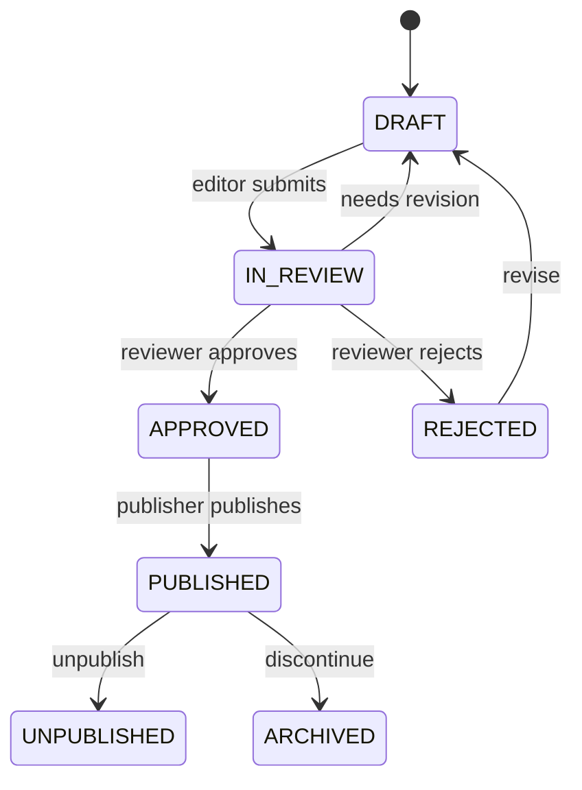

# Admin architecture

Operations console design for HomeopathyPharma.com. The admin app (`apps/admin`) is a thin client over `services/api` — all authorization, audit, and state transitions execute server-side.

## Role hierarchy

| Role | Scope | MFA |
|------|-------|-----|
| **SUPER_ADMIN** | Full platform control — roles, settings, impersonation, all queues | Mandatory |
| **ADMIN** | Day-to-day operations — catalog, orders, users (no super-user settings) | Mandatory |
| **DOCTOR** | Doctor portal only (not admin console) | Mandatory |
| **FINANCE** | Refunds, payouts, invoices, ledger read | Mandatory |
| **SUPPORT** | Tickets, order lookup, limited user read | Mandatory |
| **CONTENT_EDITOR** | Draft content, SEO metadata | Mandatory |
| **MEDICAL_REVIEWER** | Medical review of health content & doctor credentials assist | Mandatory |
| **CUSTOMER** | Storefront account only | Optional |

`SUPER_ADMIN` receives the broadest default permission set in `@homeopathypharma/auth` (`ROLE_PERMISSION_DEFAULTS`). Additional grants are stored in `RolePermission` / `UserRole` tables — never in client JWT claims alone.

## Domain modules

### Super Admin

- User & role management (`User`, `UserRole`, `Role`, `Permission`)
- Platform settings (`SETTINGS_WRITE`)
- Session administration (`GET/DELETE /v1/auth/sessions`)
- Audit log access (`AUDIT_READ`)
- Emergency impersonation (`USER_IMPERSONATE`, fully audited)
- Legal hold flags (`LegalHoldFlag`)

### Doctor Ops

- Verification queue (`DoctorVerificationStatus`: DRAFT → SUBMITTED → IN_REVIEW → APPROVED/REJECTED)
- Credential document review (private S3, presigned access only)
- Suspension / reinstatement (`DOCTOR_SUSPEND`)
- Public profile publish gating (approved doctors only in `/doctors` and sitemap)

### Product Ops

- Catalog CRUD (`Product`, `ProductVariant`, `ProductGroup`, `Ingredient`, `ProductCategoryMap`)
- Publish workflow (see below)
- Inventory batches & reservations
- Bundle composition
- Merchant Center feed reconciliation

### Order & Shipping

- Order lifecycle (`OrderStatus` state machine)
- Checkout reconciliation (server totals vs Razorpay capture)
- Shiprocket label creation & webhook-driven status updates
- NDR / RTO handling
- Return & refund initiation (routes to Finance queue)

### Finance

- Refund approval queue (ties to `PaymentStatus` REFUNDED transitions)
- Doctor payout approval (`DoctorPayout`, `DoctorEarningsLedger`)
- Invoice & tax document access
- Coupon redemption audit (`CouponRedemption`, `CustomerCoupon`)

### Content & SEO

- Knowledge graph (`BodySystem`, `Organ`, `Condition`, `PetSpecies`, `KnowledgeArticle`)
- SEO metadata (`SeoMetadata`, segmented sitemaps)
- Redirect management
- Medical review assignment (`MEDICAL_REVIEWER` role)

### Support

- Support tickets (`SupportTicket`)
- Order lookup (read-only unless `ORDER_WRITE` granted)
- Customer communication logs
- Review moderation queue assignment (`ReviewModerationQueue`)

### Compliance

- Consent records (`ConsentRecord`)
- Document access logs (`DocumentAccessLog`)
- Data retention jobs (`DataRetentionJob`)
- Content publish history (immutable)

## Publish workflow (draft → review → approved → published)

Applies to products, health content, pet content, and SEO landing pages:

**Enforcement:**

1. Public API and sitemap queries filter `status = PUBLISHED` (and `medicalReviewStatus = APPROVED` where required).
2. Publish action writes immutable `PublishHistory` row.
3. Worker jobs triggered on publish: OpenSearch index, sitemap segment, Merchant feed (if enabled).
4. `CONTENT_EDITOR` can write drafts; `MEDICAL_REVIEWER` approves health claims; `CATALOG_PUBLISH` permission required for storefront visibility.

## Queue architecture

| Queue | Model / status field | Assignee role |
|-------|----------------------|---------------|
| Doctor verification | `DoctorProfile.verificationStatus` | Admin / Medical reviewer |
| Product publish | `Product.status` | Admin / Catalog publisher |
| Content review | `KnowledgeArticle.medicalReviewStatus` | Medical reviewer |
| Review moderation | `ReviewModerationQueue` | Support / Admin |
| Refunds | Payment refund requests | Finance |
| Payouts | `DoctorPayout.status` | Finance |

Queues are API-filtered views — not separate databases. Assignment stored via `assigneeUserId` and audit logged.

## Security controls

- **MFA:** Mandatory for all admin-adjacent roles (`requiresMfa()` in `@homeopathypharma/auth`).
- **CSRF:** State-changing admin requests require `x-csrf-token` when using session cookies.
- **Audit:** Every mutation writes `AuditLog` with actor, entity, before/after snapshot.
- **Separation:** Admin app on separate origin (port 3002); no admin routes in storefront bundle.

## Related documents

- [SITE_MAP.md](./SITE_MAP.md)
- [WORKFLOWS.md](./WORKFLOWS.md)
- [SECURITY_THREAT_MODEL.md](./SECURITY_THREAT_MODEL.md)
- [LOOPHOLES.md](./LOOPHOLES.md)
