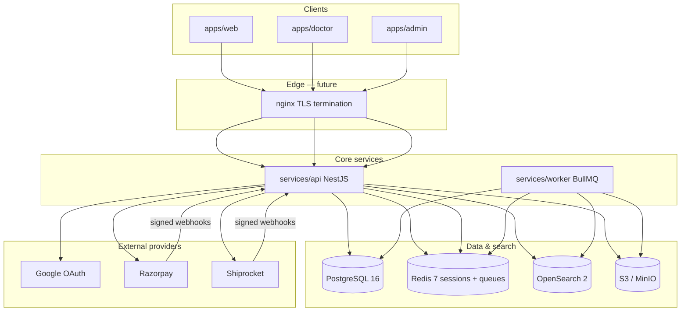

# Architecture

HomeopathyPharma.com is a **premium healthcare and ecommerce platform** for homeopathic products, doctor consultations, and medically reviewed educational content. The system is designed for India-first operations with a path to global scale (100k+ SKUs, large sitemap surface, high-traffic search).

## Repository layout

This monorepo lives under `homeopathypharma/` and is **independent** of the sibling DisplayAvenue project at the workspace root. All changes stay inside this directory.

```
homeopathypharma/
├── apps/
│   ├── web/          # Next.js storefront + content (port 3000)
│   ├── doctor/       # Doctor portal (port 3001)
│   └── admin/        # Operations console (port 3002)
├── services/
│   ├── api/          # NestJS modular monolith — source of truth (port 4000)
│   └── worker/       # BullMQ async processors
├── packages/
│   ├── auth/         # Session types, RBAC, Google token verification helpers
│   ├── config/       # Shared env, URLs, constants
│   ├── database/     # Prisma schema, migrations, seed
│   ├── integrations/ # Razorpay, Shiprocket, S3, Google, state machines
│   ├── seo/          # Sitemap, JSON-LD, robots helpers
│   ├── ui/           # Shared React components and design tokens
│   └── validation/   # Zod schemas for API payloads
├── infrastructure/   # Docker, nginx, k8s, terraform notes
├── tests/            # e2e, unit, integration, contract scaffolding
├── docs/             # Architecture, security, compliance, workflows
└── scripts/          # Dev bootstrap and tooling
```

**Build orchestration:** pnpm workspaces + Turborepo (`turbo.json`). Node **22+** required.

## System diagram



## Backend as source of truth

All business rules execute in **`services/api`**. Frontends are thin consumers:

| Domain | Backend owns |
|--------|----------------|
| Auth & sessions | Login, OTP, session lifecycle, MFA policy |
| RBAC | Roles, permissions, admin access |
| Catalog & pricing | Products, variants, publish workflow, price at checkout |
| Inventory | Batches, expiry, reservations, movements |
| Orders | Checkout sessions, immutable order snapshots |
| Payments | Razorpay orders, capture, refunds, webhook reconciliation |
| Shipments | Shiprocket integration, state machine |
| Consultations | Booking, availability, payment linkage |
| Referrals & coupons | Eligibility, ledger accrual/reversal |
| Reviews | Verified-purchase gating, moderation |
| Content | CMS pages, medical review workflow |
| SEO | Sitemap segments, metadata, feed exports |

**Never** trust client-computed totals, stock counts, payment status, or role checks. Validation schemas in `@homeopathypharma/validation` mirror API contracts; they do not replace server enforcement.

## Event-driven workers

Synchronous API paths enqueue durable work to **BullMQ** (`services/worker`):

| Queue | Responsibility |
|-------|----------------|
| `payments` | Capture reconciliation, refund follow-up |
| `orders` | Fulfillment pipeline after payment |
| `inventory` | Reservation commit/release, batch expiry |
| `shipments` | Label creation, tracking sync |
| `consultations` | Reminders, no-show handling |
| `notifications` | Email, SMS, in-app delivery |
| `search-index` | Product/content incremental indexing |
| `sitemaps` | Segment generation for 100k+ URLs |
| `feeds` | Merchant Center / product feed exports |
| `audits` | Async audit log writes |
| `referrals` | Commission accrual after delivery window |

Processors use **idempotency keys** (Redis) so retries and duplicate webhooks are safe. Failed jobs remain in BullMQ failed sets for manual replay.

## Scaling to 100k+ products

| Concern | Approach |
|---------|----------|
| **Catalog reads** | PostgreSQL for transactional data; OpenSearch for faceted search, autocomplete, and browse at scale |
| **Search indexing** | Async `search-index` queue; bulk reindex jobs; index alias swaps for zero-downtime rebuilds |
| **Sitemaps** | Segmented sitemaps by `SitemapSegment` enum (products, categories, conditions, etc.); index sitemap + chunk files ≤ 50k URLs each |
| **Media** | S3-compatible object storage; CDN in front of public assets; private buckets for medical documents |
| **Sessions & rate limits** | Redis cluster; sliding-window rate limits per IP/user |
| **API** | Stateless NestJS instances behind load balancer; horizontal pod autoscaling in k8s |
| **Workers** | Separate worker pool per queue family; scale `search-index` and `sitemaps` independently |
| **Database** | Connection pooling (PgBouncer); read replicas for reporting; partition large audit/ledger tables by time |

## OpenSearch

- **Index prefix:** `OPENSEARCH_INDEX_PREFIX` (default `hp`)
- **Documents:** products (with variants, categories, stock signal), content pages, doctors (public profiles only)
- **Not indexed:** draft/unpublished entities, soft-deleted rows, private medical uploads
- **Security:** production clusters enable fine-grained access control; dev compose disables security plugin for simplicity

## Redis

- **Sessions:** HTTP-only cookie → session ID → Redis hash (`REDIS_PREFIX`)
- **Queues:** BullMQ connection (`REDIS_URL`)
- **Idempotency:** checkout, payment verify, webhook handlers
- **Cache (optional):** catalog hot paths, rate-limit counters

## S3 (MinIO locally)

- **Buckets:** `homeopathypharma` with `public/` prefix for catalog images; private prefix for verification documents
- **Upload flow:** presigned PUT from API; virus scan + MIME validation before promotion to public prefix
- **Env:** see `.env.example` (`S3_*` variables)

## Architecture decisions (ADR summary)

| # | Decision | Rationale |
|---|----------|-----------|
| ADR-001 | **Modular monolith** (NestJS) over microservices early | Faster iteration; clear module boundaries; extract hot paths later |
| ADR-002 | **PostgreSQL** as system of record | ACID for orders, inventory, ledgers; Prisma for schema evolution |
| ADR-003 | **OpenSearch** for catalog/content search | Facets and relevance at 100k+ SKU scale without overloading Postgres |
| ADR-004 | **Redis** for sessions + queues | Low-latency session lookup; BullMQ maturity |
| ADR-005 | **S3-compatible storage** | Portable between MinIO (dev) and AWS S3 (prod) |
| ADR-006 | **Server-side state machines** | Payment/shipment transitions enforced in API only (`packages/integrations`) |
| ADR-007 | **Immutable snapshots & ledgers** | Order line prices frozen at checkout; referral ledger append-only |
| ADR-008 | **Event-driven side effects** | Webhooks and notifications off the request path |
| ADR-009 | **pnpm + Turborepo** | Efficient monorepo installs and cached builds |
| ADR-010 | **India-first integrations** | INR, Razorpay, Shiprocket; extensible provider interfaces |
| ADR-011 | **Content vs commerce separation** | `PageKind` and medical review workflow distinct from product publish |
| ADR-012 | **Soft delete** | `deletedAt` on user-facing entities; hard delete only for legal retention jobs |

## API surface

- **Prefix:** `/v1`
- **Auth:** session cookie (`SESSION_COOKIE_NAME`) + RBAC guards
- **Idempotency:** `Idempotency-Key` header on checkout, payments, shipments
- **Correlation:** `x-correlation-id` / `x-request-id` on all requests

See `services/api/README.md` for module route map.

## Observability

- Structured JSON logging (`services/api/src/observability`)
- OpenTelemetry hooks via `OTEL_EXPORTER_OTLP_ENDPOINT`
- Sentry optional via `SENTRY_DSN`

## Related documents

- [DATA_MODEL.md](./DATA_MODEL.md) — entities and integrity rules
- [WORKFLOWS.md](./WORKFLOWS.md) — end-to-end flows
- [SECURITY_THREAT_MODEL.md](./SECURITY_THREAT_MODEL.md) — controls and threat closure
- [SEO.md](./SEO.md) — URL and schema policy
- [ASSUMPTIONS.md](./ASSUMPTIONS.md) — default technology choices
