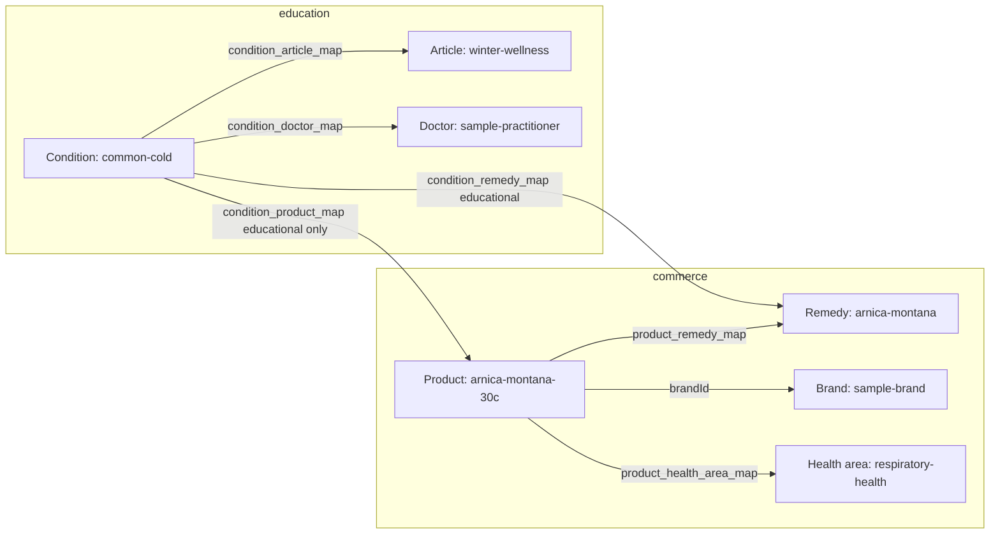

# Master multidimensional catalogue architecture

HomeopathyPharma.com treats the catalogue as a **graph of first-class entity types**, not a single hierarchical category tree. Commerce (SKUs, inventory, pricing), education (conditions, remedies, articles), and discovery (health areas, brands) share relationships but remain **separate tables and publish workflows**.

Canonical schema: `packages/database/prisma/schema.prisma` and migration `20260320140000_catalogue_entity_graph`.

## Design principles

1. **Separate entity types** — each dimension has its own table, admin screens, and URL pattern. Do not collapse remedies, brands, conditions, and shop categories into one “mega category” table.
2. **Product identity is layered** — brand and product group define the commercial family; remedy + potency + form + pack define the therapeutic/commercial variant; SKU + batch define fulfilment.
3. **Attributes are admin-extensible** — potency systems, dosage forms, and pack sizes are reference data, not hard-coded enums in application code.
4. **Brands are first-class** — public brand hubs at `/brands/{slug}/` with logo, country, manufacturer links, regulatory notes, SEO, and product listings.
5. **Manufacturers ≠ brands** — manufacturing licence holders are linked to brands via `brand_manufacturer_map`; never assume one-to-one identity.
6. **Shop discovery ≠ medical claims** — `/shop/health-areas/` supports product browsing by wellness theme; `/health/conditions/` is educational content only.
7. **Badges require audit** — “Doctor recommended” and similar badges never auto-apply; each assignment must have an auditable source (doctor profile, campaign record, or admin approval).
8. **Compliance-aware, not compliance-asserting** — architecture supports Indian regulatory context (PCIM&H / CCRH) but **does not assert legal clearance** for product forms or claims; local counsel and licensing validation are mandatory before go-live.

---

## Entity types (separate tables)

| Entity | Role | Public URL (when published) | Indexed |
|--------|------|----------------------------|---------|
| **Categories** | Store navigation tree (`treeKind`: medicines, accessories, …) | `/categories/{slug}/` | Yes (published) |
| **Remedies** | Master remedy monograph (Arnica montana, …) | `/remedies/{slug}/` | Yes (medically reviewed) |
| **Brands** | Commercial brand identity | `/brands/{slug}/` | Yes (published) |
| **Manufacturers** | Licence holder / GMP entity | `/manufacturers/` (directory); detail TBD | Directory yes; detail when substantive |
| **Body systems** | Anatomical system education | `/health/body-systems/{slug}/` | Yes (reviewed) |
| **Organs** | Organ-specific education | `/health/organs/{slug}/` | Yes (reviewed) |
| **Conditions** | Condition guides (no treatment claims) | `/health/conditions/{slug}/` | Yes (reviewed) |
| **Symptoms** | Symptom education | `/health/symptoms/{slug}/` | Yes (reviewed) |
| **Age groups** | Life-stage education | `/health/age-groups/{slug}/`, `/health/child-health/`, `/health/senior-health/` | Yes (reviewed) |
| **Gender topics** | Gender-specific wellness education | `/health/gender-health/{slug}/`, `/health/womens-health/`, `/health/mens-health/` | Yes (reviewed) |
| **Pets** | Species and pet condition content | `/pets/{species}/`, `/pets/conditions/{slug}/`, `/health/pet-health/` | Yes (published) |
| **Health areas** | Shop-by wellness themes (discovery) | `/shop/health-areas/{slug}/` | Yes (published) |
| **Doctors** | Verified practitioner profiles | `/doctors/{slug}/` | Yes (approved) |
| **Products / variants** | Sellable SKUs | `/products/{slug}/` | Yes (published) |
| **Bundles** | Curated multi-SKU kits | `/bundles/{slug}/` | Yes (published) |

**Anti-pattern:** a single `categories` row typed as “remedy”, “brand”, and “condition” with a `type` column. That breaks independent publish workflows, SEO segmentation, and regulatory separation.

---

## Product identity model

```
Brand
  └── Product (product group / commercial listing)
        ├── Remedy (via product_remedy_map — master monograph)
        ├── Potency (variant attribute → potencies table)
        ├── Dosage form (variant attribute → dosage_forms table)
        ├── Pack (quantity + unit on variant)
        └── ProductVariant (SKU)
              └── InventoryBatch (lot, expiry, quantity)
```

### Layers explained

| Layer | Entity | Example |
|-------|--------|---------|
| Brand | `brands` | SBL, Dr. Reckeweg, Schwabe India |
| Product group | `products` | “Arnica Montana — SBL” (shared title, images, copy) |
| Remedy link | `product_remedy_map` | Links product to master `remedies` row `arnica-montana` |
| Potency | `potencies` + `product_variants.potencyId` | 30C, 200C, 1M (admin-extensible per `potency_systems`) |
| Form | `dosage_forms` + `product_variants.dosageFormId` | Globules, dilution, tablet, ointment |
| Pack | `product_variants.packQuantity` + `packUnit` | 30 g, 100 ml, pack of 3 |
| SKU / variant | `product_variants` | Unique sellable unit with GTIN, MRP, tax code |
| Batch | `inventory_batches` | Lot ABC123, expiry 2028-06, FEFO picking |

Potency, form, and pack are **variant dimensions**, not category tree nodes. Admin adds new potencies and forms without code deploys.

---

## Source classifications

Remedies carry a **source type** (`remedy_source_types`) describing materia medica origin:

| Code (examples) | Meaning |
|-----------------|---------|
| `PLANT` | Botanical source |
| `MINERAL` | Mineral / elemental |
| `CHEMICAL` | Synthetic or chemical compound |
| `ANIMAL` | Animal-derived (where permitted) |
| `NOSODE` | Nosode preparation |
| `SARCODE` | Sarcode preparation |
| `IMPONDERABILIA` | Imponderabilia |
| `BIOTINIC` | Biotic / complex sources |

Source type informs educational copy and filtering; it does **not** replace pharmacopoeial references (`pharmacopoeialRefs`) or ingredient linkage (`ingredients`).

---

## Brands (first-class)

Each published brand has a dedicated hub:

**URL:** `/brands/{slug}/`

**Hub content:**

- Logo (`logoStorageKey`)
- Country of origin (`countryCode`)
- Official website (outbound, `rel="noopener"`)
- Linked manufacturers (`brand_manufacturer_map`, primary flag)
- Regulatory notes (`regulatoryNotes`) — internal/compliance-facing summary, not a legal opinion
- SEO title & description (`seoTitle`, `seoDescription`)
- Product grid (published products where `products.brandId` matches)
- Optional brand documents (`brand_documents`) — certificates, labels (admin-only until approved for public)

**Index:** `/brands/` lists all published brands; `/shop/brands/` is a shop-context entry point linking to the same entities.

Brands must not be reduced to a filter chip on category pages only — they receive canonical URLs and sitemap segment inclusion.

---

## Manufacturers (separate from brands)

| Aspect | Brand | Manufacturer |
|--------|-------|--------------|
| Purpose | Customer-facing identity, marketing | Licence holder, GMP, legal entity |
| Example | “SBL” consumer brand | “Standard Homeopathic Laboratory” manufacturing unit |
| Relationship | Many-to-many via `brand_manufacturer_map` | Same |
| Public page | `/brands/{slug}/` | `/manufacturers/` directory; per-manufacturer pages when substantive |

Product variant labels may show “Marketed by {brand} · Manufactured by {manufacturer}” when both are published.

---

## Shop-by health areas vs condition pages

| Surface | Path | Intent | Claims |
|---------|------|--------|--------|
| **Health areas** | `/shop/health-areas/{slug}/` | Product discovery by wellness theme (digestive, respiratory, skin, pet care) | **No disease treatment claims** — “products often browsed for…” framing |
| **Conditions** | `/health/conditions/{slug}/` | Medically reviewed education about a condition | **No cure/treatment claims** — general information, seek professional care |

**Mapping:** `product_health_area_map` links products to health areas for merchandising. `condition_product_map` links products to conditions for **educational cross-reference only** with mandatory `relationshipNote` and no auto-generated therapeutic language.

---

## Product badges

Badges (`product_badges`, `product_badge_map`) include codes such as:

- `BESTSELLER` — sales signal (automatable with thresholds)
- `NEW_ARRIVAL` — publish date window
- `DOCTOR_RECOMMENDED` — **never auto-assigned**

### Doctor recommended rule

A product may display “Doctor recommended” only when:

1. An active `product_badge_map` row exists for badge code `DOCTOR_RECOMMENDED`, **and**
2. An auditable link exists: e.g. `doctor_recommendation_records` (doctor ID, product ID, approval timestamp, optional consultation context), **or** explicit admin attestation with audit log entry.

Without (2), the badge must not render on PDP, PLP, or JSON-LD.

---

## Relationship graph (examples)

Educational and merchandising links are **typed edges**, not merged pages.



**Rules for condition ↔ product edges:**

- Copy on condition pages lists related products under “Products sometimes discussed in homeopathic literature” or similar — never “Treat X with Y”.
- Condition ↔ doctor edges surface verified practitioners for consultation CTAs, not product endorsement unless separately badge-approved.

---

## SEO URL patterns

| Pattern | Entity | Notes |
|---------|--------|-------|
| `/remedies/` | Remedy index | Master monograph directory |
| `/remedies/{slug}/` | Remedy detail | e.g. `/remedies/arnica-montana/` |
| `/brands/` | Brand index | First-class brand directory |
| `/brands/{slug}/` | Brand hub | e.g. `/brands/sample-brand/` |
| `/bundles/` | Bundle index | Curated kits |
| `/bundles/{slug}/` | Bundle detail | e.g. `/bundles/family-starter/` |
| `/shop/health-areas/` | Health area index | Shop discovery |
| `/shop/health-areas/{slug}/` | Health area PLP | e.g. `/shop/health-areas/digestive-health/` |
| `/categories/{slug}/` | Store category | Navigation tree |
| `/products/{slug}/` | Product / variant PDP | Prefer ProductGroup canonical when variants are thin |
| `/health/conditions/{slug}/` | Condition guide | MedicalWebPage schema |
| `/health/womens-health/` etc. | Life-stage / gender hubs | Educational shells |

Trailing slashes enforced (`next.config.ts` → `trailingSlash: true`). One canonical URL per entity; 301 on slug changes.

---

## What must NOT be indexed

| Surface | Reason |
|---------|--------|
| `/search`, `/search?q=*` | Utility, thin/duplicate |
| `/cart`, `/checkout`, `/account/*` | Private / transactional |
| `/login`, `/signup`, `/otp`, `/logout` | Auth |
| `/consult/book/*` | Booking flow (mid-auth) |
| Draft / unpublished catalog entities | Quality gate |
| Soft-deleted rows | Removed from public API |
| Admin (`:3002`) and doctor portal (`:3001`) | Separate origins, `noindex` |
| Filter/sort query permutations | Duplicate content (`?sort=`, faceted combos) |
| Badge-only or campaign landing drafts | Until compliance review |
| Product–condition edges without reviewed copy | Prevents implied treatment claims |

See [SEO.md](./SEO.md) for sitemap segmentation and robots rules.

---

## Regulatory note (India)

Homeopathic medicines and related product forms in India fall under frameworks administered by **PCIM&H** (Pharmacopoeia Commission for Indian Medicine & Homoeopathy) and institutional guidance from **CCRH** (Central Council for Research in Homoeopathy), alongside state licensing and labelling rules.

**This architecture:**

- Separates educational content from commerce
- Stores regulatory notes and manufacturer licence fields for admin review
- Supports batch traceability and label metadata on variants

**This architecture does NOT:**

- Assert that any product form, claim, or label is legally cleared for sale in any jurisdiction
- Replace qualified legal, regulatory, or pharmacovigilance review

All product listings, health copy, and badges require **local counsel and licensing validation** before production publish.

---

## Related documents

- [DATA_MODEL.md](./DATA_MODEL.md) — entity relationships and integrity rules
- [SITE_MAP.md](./SITE_MAP.md) — full URL inventory
- [SEO.md](./SEO.md) — indexing, sitemaps, schema.org
- [COMPLIANCE.md](./COMPLIANCE.md) — disclaimers and review workflows
- [ADMIN_ARCHITECTURE.md](./ADMIN_ARCHITECTURE.md) — catalog admin boundaries
