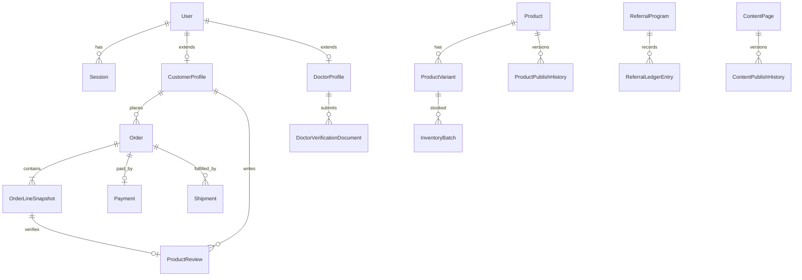

# Data model

Domain overview for HomeopathyPharma.com. The canonical schema is `packages/database/prisma/schema.prisma`. This document explains **entities, relationships, and integrity rules** — not every column.

## Domain overview



### Identity & access

| Entity | Purpose |
|--------|---------|
| `User` | Core account; links to Google/OTP identities |
| `Session` | Server-side session metadata (payload in Redis) |
| `Role` / `Permission` | RBAC for admin, doctor, support |
| `ConsentRecord` | Terms, privacy, marketing timestamps |

### Commerce

| Entity | Purpose |
|--------|---------|
| `Product`, `ProductVariant` | Catalog SKU, attributes, publish status |
| `Category`, `Brand` | Navigation and filtering |
| `InventoryBatch` | Batch/lot tracking with expiry |
| `InventoryMovement` | Append-only stock ledger |
| `Cart`, `CartLine` | Pre-checkout basket |
| `CheckoutSession` | Priced snapshot before payment |
| `Order`, `OrderLineSnapshot` | Immutable post-payment record |
| `Coupon`, `CouponRedemption` | Promotions with usage limits |
| `Payment` | Razorpay linkage and status |
| `Shipment`, `ShipmentEvent` | Shiprocket lifecycle |

### Healthcare

| Entity | Purpose |
|--------|---------|
| `DoctorProfile` | Public profile after verification |
| `DoctorVerificationSubmission` | Credential review workflow |
| `DoctorVerificationDocument` | Private uploads (registration, ID) |
| `ConsultationService` | Offerings (online/offline) |
| `Appointment` | Booking with payment state |
| `MedicalReviewSubmission` | Content clinical review |

### Content & SEO

| Entity | Purpose |
|--------|---------|
| `ContentPage` | Articles, condition pages, organ pages |
| `ContentPublishHistory` | Immutable publish audit |
| `SeoMetadata` | Title, description, canonical, robots |
| `SitemapSegmentConfig` | Chunk boundaries for large sitemaps |

### Trust & growth

| Entity | Purpose |
|--------|---------|
| `ProductReview` | Moderated, verified-purchase reviews |
| `ReferralCode`, `ReferralLedgerEntry` | Commission accounting |
| `SupportTicket` | Customer support |
| `AuditLog` | Admin and system actions |

## Integrity rules

### 1. Order snapshots (immutable pricing)

When checkout completes, the API **freezes** commercial facts into `OrderLineSnapshot`:

- Product title, variant label, SKU
- Unit price, tax breakdown, discounts applied
- Quantity ordered

**Rules:**

- Snapshots are **never updated** after order creation.
- Refunds reference snapshot lines; they do not rewrite historical prices.
- Client-displayed cart totals must match server `CheckoutSession` totals; mismatches reject checkout.

### 2. Inventory batches & expiry

Stock is tracked per **`InventoryBatch`** (receipt date, expiry date, quantity on hand).

**Rules:**

- FEFO/FIFO picking enforced at reservation time (nearest expiry first unless overridden by admin policy).
- `InventoryMovement` rows are **append-only** (`RECEIPT`, `SALE`, `RESERVATION`, `RELEASE`, `ADJUSTMENT`, `RETURN`, `EXPIRE`, `TRANSFER`).
- Reservations held during checkout TTL; released on timeout or payment failure.
- Expired batches excluded from available quantity; `EXPIRE` movements generated by scheduled job.
- No negative `quantityOnHand` — database constraints + transactional checks.

### 3. Ledger immutability (referrals & money audit)

`ReferralLedgerEntry` and payment audit trails follow **append-only** semantics:

| Entry type | Use |
|------------|-----|
| `ACCRUAL` | Commission earned after eligibility window |
| `REVERSAL` | Order return/cancellation clawback |
| `PAYOUT` | Withdrawal to referrer |
| `ADJUSTMENT` | Admin correction with mandatory audit reason |

**Rules:**

- No `UPDATE` or `DELETE` on ledger rows in application code.
- Corrections are new `ADJUSTMENT` entries referencing the original accrual.
- Payout totals = sum(entries) per referrer; reconciled in admin reports.

### 4. Verified reviews only

`ProductReview` requires a **verified purchase** link:

- `orderLineSnapshotId` must reference a delivered order line for the same customer and product variant.
- One review per customer per variant (unique constraint).
- `ReviewModerationStatus` must be `APPROVED` before public display.
- Aggregate rating displayed on PDP = average of **approved** reviews only (computed or materialized, never hand-edited).

### 5. Content vs commerce pages

`PageKind` distinguishes page classes:

| Kind | Examples | Publish workflow |
|------|----------|------------------|
| `COMMERCE` | Product PDP, category PLP | Catalog publish + optional medical disclaimer |
| `CONTENT` | Conditions, organs, articles | Medical review required (`MedicalReviewStatus`) |
| `LEGAL` | Terms, privacy, disclaimer | Legal review track |
| `LANDING` | Campaign pages | Marketing + compliance review |
| `SYSTEM` | Health checks, error pages | Not in sitemap |

**Rules:**

- Content pages must not embed unverified therapeutic claims.
- Commerce pages show product facts from catalog; educational claims link to reviewed content pages.
- Cross-linking does not merge workflows — a product publish does not auto-approve content.

### 6. Soft-delete policy

Entities with user-facing history use **`deletedAt`** (nullable timestamp):

| Soft-delete | Hard-delete |
|-------------|-------------|
| Users (account closure) | Ephemeral OTP tokens |
| Products (discontinued) | Idempotency keys (TTL) |
| Content pages (unpublished) | Session keys (TTL) |
| Doctor profiles (suspended) | Webhook dedupe keys (retention window) |

**Rules:**

- Soft-deleted rows **excluded** from public API, search index, and sitemaps.
- Orders, payments, ledger entries, and audit logs are **never** soft-deleted — retention follows compliance policy.
- Admin can view soft-deleted entities with `audit:read` permission for support investigations.
- Unique slugs may be recycled only after cooling period (configurable) to avoid SEO collisions.

## Enumerations (selected)

Key status enums drive valid transitions — always validate server-side:

- `OrderStatus`, `PaymentStatus`, `ShipmentStatus`
- `DoctorVerificationStatus`, `MedicalReviewStatus`, `PublishStatus`
- `AppointmentStatus`, `ReviewModerationStatus`

State transition helpers live in `packages/integrations/src/state-machines.ts` and must only run in the API layer.

## Indexing & search sync

| Source table | OpenSearch doc | Sync trigger |
|--------------|----------------|--------------|
| Published products | `product` | Publish/unpublish, inventory signal change |
| Approved content | `content` | Medical review approval |
| Approved doctors | `doctor` | Verification approval |

Draft, rejected, soft-deleted, and private documents are **never** indexed.

## Migrations & seed

```bash
pnpm db:generate    # Prisma client
pnpm db:migrate     # apply migrations (dev)
pnpm db:seed        # demo data (non-production)
```

Production deploys use `pnpm db:migrate:deploy`. Seed scripts must not create fake medical credentials or misleading product claims.

## Related documents

- [ARCHITECTURE.md](./ARCHITECTURE.md)
- [WORKFLOWS.md](./WORKFLOWS.md)
- [SECURITY_THREAT_MODEL.md](./SECURITY_THREAT_MODEL.md)
- [COMPLIANCE.md](./COMPLIANCE.md)
