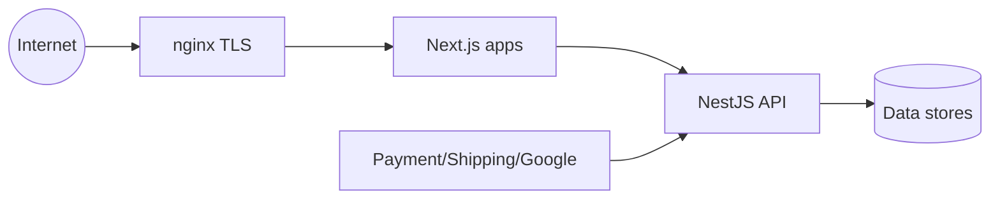

# Security threat model

OWASP-aligned security posture for HomeopathyPharma.com. This document maps **threats → controls → verification** for production readiness reviews.

## Scope

| In scope | Out of scope (handled elsewhere) |
|----------|----------------------------------|
| Web, doctor, admin apps | Corporate IT endpoint security |
| NestJS API + worker | Physical datacenter security |
| PostgreSQL, Redis, OpenSearch, S3 | Provider SOC reports (request from vendor) |
| Razorpay, Shiprocket, Google OAuth | Third-party breach response (vendor SLAs) |

## Trust boundaries

Untrusted input crosses at: browser → API, webhooks → API, file uploads → S3.

## OWASP Top 10 controls

| Risk | Control |
|------|---------|
| **A01 Broken Access Control** | Global RBAC guards; permission checks on every admin/doctor route; resource ownership validation (customer sees own orders only) |
| **A02 Cryptographic Failures** | TLS 1.2+ at edge; secrets in env/vault; bcrypt/argon for passwords if enabled; no secrets in client bundles |
| **A03 Injection** | Prisma parameterized queries; Zod/class-validator input validation; OpenSearch query builder (no raw string concat) |
| **A04 Insecure Design** | Backend source of truth; idempotency; state machines; immutable ledgers |
| **A05 Security Misconfiguration** | Security headers (see `infrastructure/nginx/README.md`); disable debug in prod; MinIO/S3 bucket policies least-privilege |
| **A06 Vulnerable Components** | Dependabot/npm audit in CI; pinned base images |
| **A07 Auth Failures** | Server-side Google ID token verification (`GoogleIdTokenVerifierImpl` — verify signature, `aud`, `iss`, `exp` via `google-auth-library`); NEVER trust client user IDs; OTP rate limits; session rotation on privilege change; MFA mandatory for SUPER_ADMIN, ADMIN, DOCTOR, FINANCE, SUPPORT, CONTENT_EDITOR, MEDICAL_REVIEWER (`requiresMfa()`) |
| **A08 Software/Data Integrity** | Razorpay webhook HMAC mandatory (`assertWebhookSignatureOrThrow`); Shiprocket webhook signature; CSRF token on cookie-auth mutations (`x-csrf-token`); signed deploy artifacts; CI lint/test gates |
| **A09 Logging Failures** | Structured audit logs; correlation IDs; no PII/passwords in logs |
| **A10 SSRF** | Allowlist outbound URLs for integrations; no user-controlled fetch URLs |

## Threat closure matrix

### Fake doctor signup

| Threat | Malicious actor submits fraudulent credentials to appear as licensed practitioner |
|--------|----------------------------------------------------------------------------------|
| Controls | Manual verification workflow; private document storage; duplicate registration lookup; `DoctorVerificationStatus` gating; suspend without hard-delete for investigation |
| Verification | E2E test: unverified doctor cannot accept bookings; API returns 403 on doctor-only routes |

### Fake reviews

| Threat | Spam, astroturfing, competitor sabotage |
|--------|----------------------------------------|
| Controls | Verified purchase requirement (`orderLineSnapshotId`); moderation queue; rate limits; duplicate review constraint |
| Verification | Integration test: review without delivered order rejected; unapproved review not in public API |

### Coupon / referral abuse

| Threat | Self-referral, multi-account farming, coupon stacking exploits |
|--------|----------------------------------------------------------------|
| Controls | One referral credit per referee; cooling periods; checkout-level coupon stacking rules; ledger reversals on returns; velocity limits |
| Verification | Contract tests for checkout pricing; integration tests for reversal entries |

### Refund fraud

| Threat | Customer claims non-receipt while delivered; duplicate refund requests |
|--------|-----------------------------------------------------------------------|
| Controls | Refund requires admin role + shipment proof; idempotent refund API; partial refund caps tied to snapshot lines; audit log |
| Verification | Integration test: double refund rejected via idempotency |

### Overselling

| Threat | Selling more units than available (race at checkout) |
|--------|-----------------------------------------------------|
| Controls | **Inventory reservation before payment** — transactional `StockReservation` at checkout start; batch-level quantity checks; reservation TTL; movement ledger; payment only after reservation succeeds |
| Verification | Integration test: concurrent checkout attempts — only N succeed; reservation released on payment failure/timeout |

### Payment / webhook spoofing

| Threat | Attacker fakes payment success or webhook events |
|--------|--------------------------------------------------|
| Controls | Razorpay payment signature verify (`razorpay_order_id|payment_id` HMAC with key secret); **webhook `X-Razorpay-Signature` mandatory** via `assertWebhookSignatureOrThrow` — reject unsigned webhooks; Shiprocket webhook signature; idempotent webhook store; payment state machine enforces CREATED→PENDING→AUTHORIZED→CAPTURED |
| Verification | Integration tests with valid/invalid signatures; reject unsigned webhooks |

**Implementation references:**

- `@homeopathypharma/integrations` — `assertWebhookSignatureOrThrow`, Razorpay/Shiprocket clients
- `services/api/src/modules/webhooks/` — signature verification hooks (`@Public`, CSRF skipped)
- Google ID token: **`GoogleIdTokenVerifierImpl.verifyIdToken`** on backend only — client sends `{ idToken }` to `POST /v1/auth/google`; never trust client-decoded JWT or user IDs

### Unauthorized admin edits

| Threat | Stolen session or privilege escalation changing prices, orders, or content |
|--------|---------------------------------------------------------------------------|
| Controls | RBAC permissions; **MFA mandatory** for admin-adjacent roles; CSRF token on state-changing requests; optional IP allowlist (`ADMIN_ALLOWED_IPS`); audit log on mutations; separate admin app origin |
| Verification | Contract tests for 403 without permission; audit row created on admin write |

### Content tampering

| Threat | Unauthorized modification of medical or legal pages |
|--------|-----------------------------------------------------|
| Controls | Publish workflow; medical review for `CONTENT`; immutable publish history; no direct DB edits in prod |
| Verification | API test: draft content not publicly readable |

### Malware uploads

| Threat | Malicious files in product images or doctor documents |
|--------|------------------------------------------------------|
| Controls | Presigned upload with content-type allowlist; size limits; async virus scan before public promotion; private bucket for medical docs |
| Verification | Upload test rejects `.exe`; public URL not issued until scan pass |

### Broken access control (BAC)

| Threat | IDOR — access another user's orders, documents, or sessions |
|--------|--------------------------------------------------------------|
| Controls | Resource scoped queries (`where: { customerId: session.userId }`); doctor sees own patients only; signed URLs short-lived for private files |
| Verification | Integration tests per resource type for horizontal privilege escalation |

### Stale states

| Threat | Order shows shipped while payment failed; appointment confirmed after cancel |
|--------|-------------------------------------------------------------------------------|
| Controls | Server-side state machines; webhook reconciliation jobs; periodic consistency sweeps in worker |
| Verification | Unit tests for invalid transitions throwing `InvalidStateTransitionError` |

### Duplicate orders / bookings

| Threat | Double-submit checkout or appointment |
|--------|--------------------------------------|
| Controls | `Idempotency-Key` on checkout/payment; unique constraints on appointment slot locks; webhook dedupe keys |
| Verification | Integration test: replay same idempotency key returns same result |

### Price mismatches

| Threat | Client sends lower price than server catalog |
|--------|---------------------------------------------|
| Controls | Server computes all totals; client display is read-only; checkout rejects tampered amounts; snapshots freeze prices |
| Verification | Contract test: checkout response amount matches sum of server line items |

### Private page indexing

| Threat | Account, checkout, admin, or medical pages indexed by search engines |
|--------|---------------------------------------------------------------------|
| Controls | `robots.txt` + `noindex` on authenticated routes; `SeoMetadata.robots`; no sitemap entries for private routes |
| Verification | SEO package tests; manual Search Console inspection |

### Medical document exposure

| Threat | Doctor verification docs or patient uploads leaked via public URLs |
|--------|---------------------------------------------------------------------|
| Controls | Private S3 prefix; presigned GET with short TTL; auth check before presign; no CDN cache on private paths; audit on access |
| Verification | Pen test: unauthenticated presign request rejected |

## Session security

| Property | Value |
|----------|-------|
| Storage | Redis (`REDIS_URL`, `REDIS_PREFIX`) |
| Transport | HTTP-only cookie (`SESSION_COOKIE_NAME`) |
| TTL | `SESSION_TTL_SECONDS` (default 14 days) |
| Rotation | New session on login; invalidate on logout and password change |
| CSRF | SameSite cookie **plus** `x-csrf-token` header on all state-changing cookie-auth requests (POST/PUT/PATCH/DELETE); `@Public` webhook routes exempt |
| MFA | Mandatory enrollment for SUPER_ADMIN, ADMIN, DOCTOR, FINANCE, SUPPORT, CONTENT_EDITOR, MEDICAL_REVIEWER before privileged access |

## Secrets management

| Environment | Approach |
|-------------|----------|
| Local | `.env` from `.env.example` (never commit) |
| Staging/Prod | Vault / cloud secret manager; inject at deploy |
| Rotation | Razorpay webhook secret, Shiprocket secret, session secret on compromise playbook |

## Incident response (summary)

1. **Detect** — alerts on webhook verify failures, auth anomaly spikes, audit suspicious admin actions.
2. **Contain** — revoke sessions, disable compromised API keys, block IP ranges.
3. **Eradicate** — patch vulnerability, rotate secrets.
4. **Recover** — replay failed webhooks from provider dashboards; reconcile ledger.
5. **Review** — post-incident doc; update this threat model.

## Related documents

- [WORKFLOWS.md](./WORKFLOWS.md)
- [COMPLIANCE.md](./COMPLIANCE.md)
- [infrastructure/nginx/README.md](../infrastructure/nginx/README.md)
