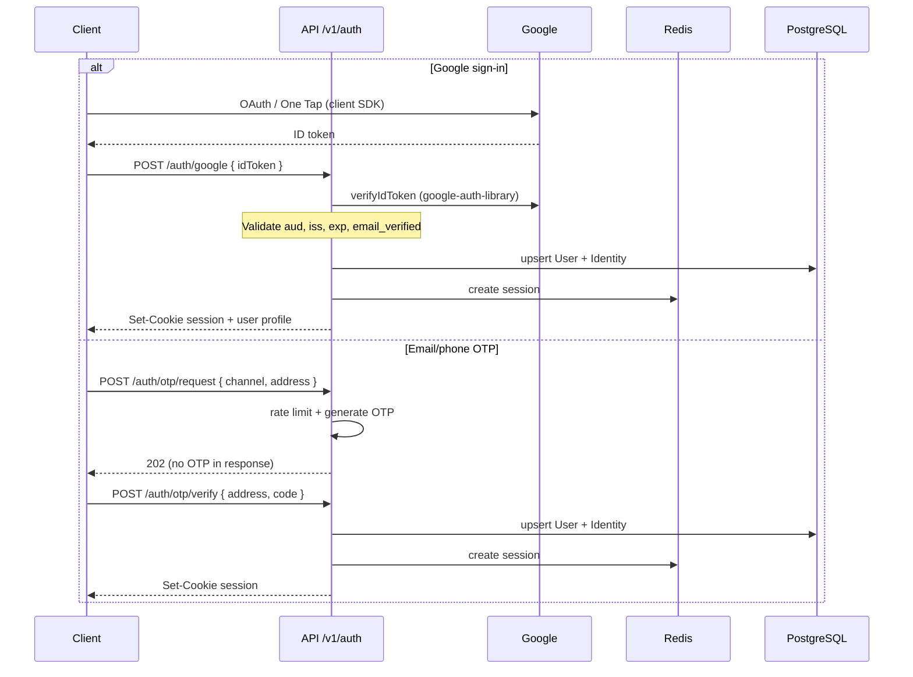
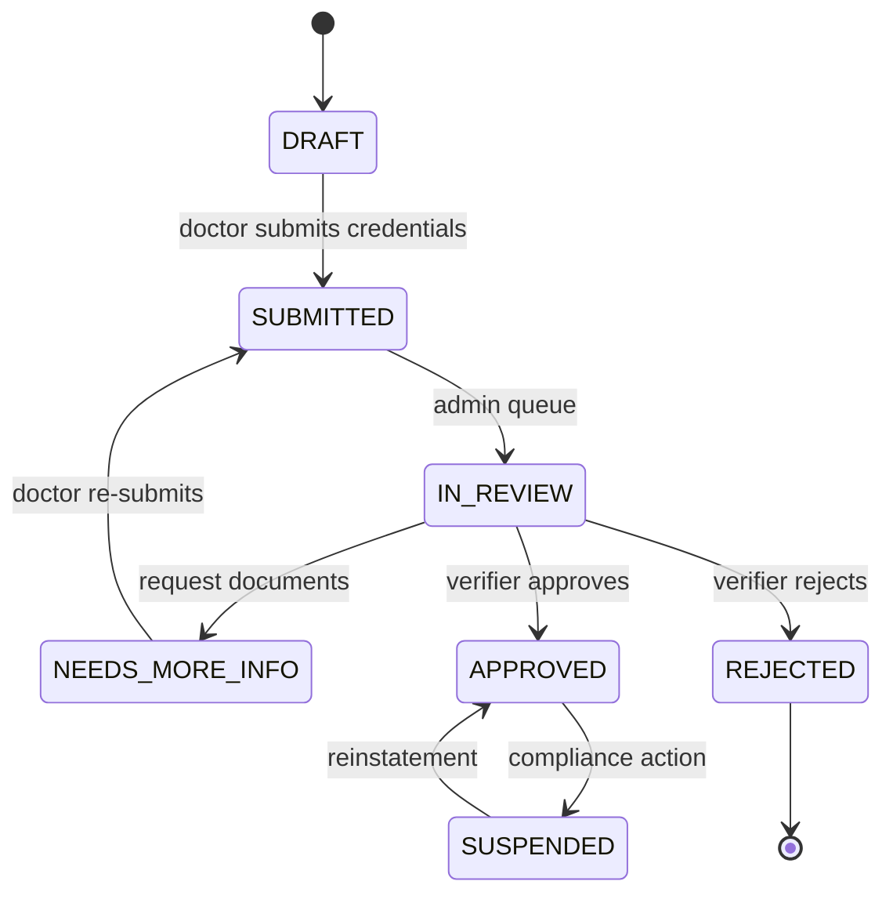
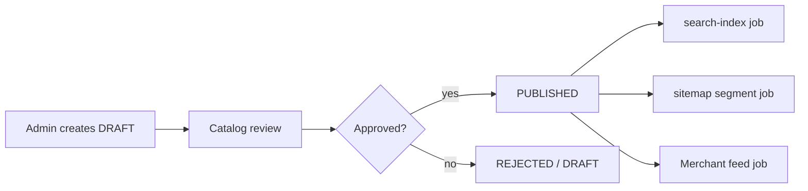
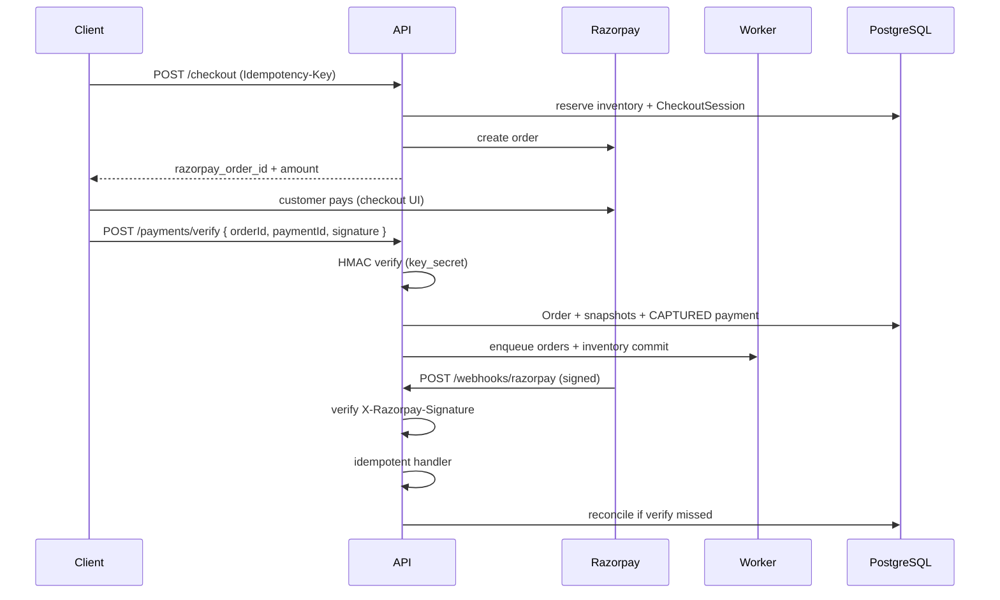
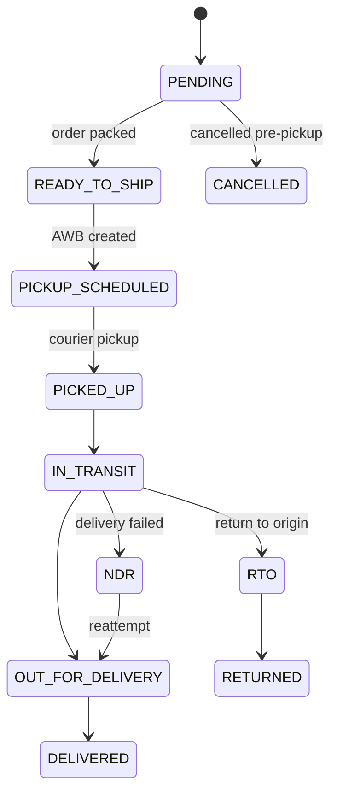
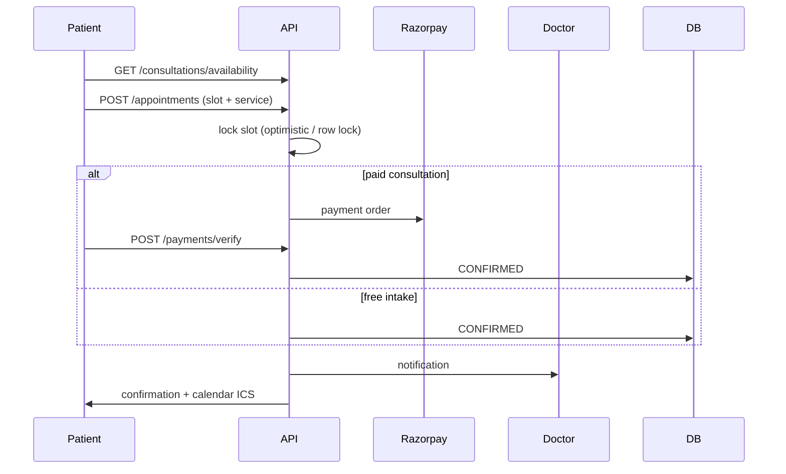
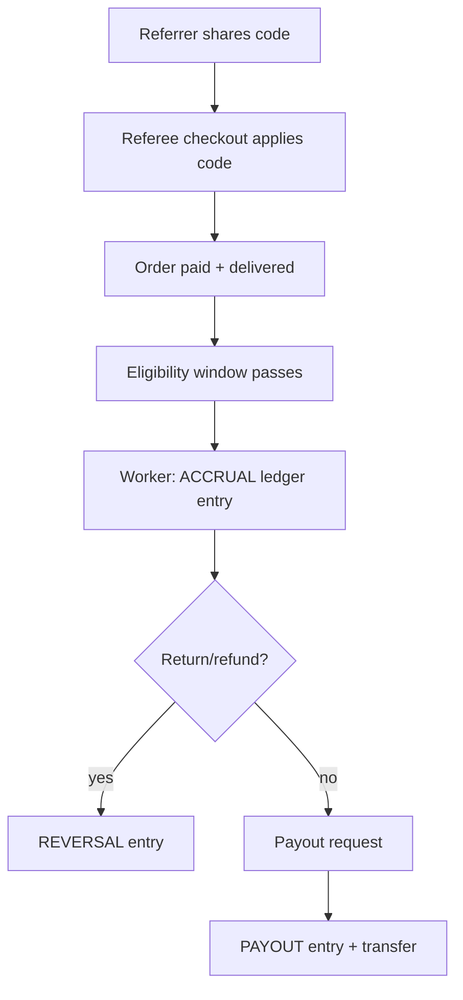
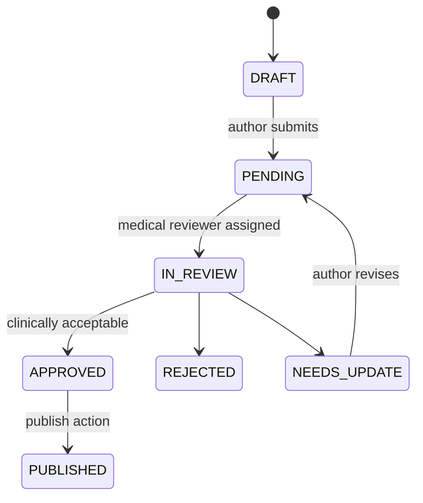

# Workflows

End-to-end flows for HomeopathyPharma.com. All paths assume **server-side enforcement** in `services/api` unless noted.

## 1. Google / OTP authentication

**Key controls:**

- Google ID tokens verified **only on backend** (`packages/auth/src/google/verify-id-token.ts`).
- OTP attempts capped (`OTP_MAX_ATTEMPTS`); OTP TTL (`OTP_TTL_SECONDS`).
- Session cookie: `HttpOnly`, `Secure` in production, `SameSite=Lax`.
- Account status checked (`ACTIVE` vs `SUSPENDED`/`LOCKED`).

## 2. Doctor verification

**Steps:**

1. Doctor registers (Google/OTP) → `DoctorProfile` in `DRAFT`.
2. Uploads registration certificate, government ID → **private S3** prefix; presigned URLs expire quickly.
3. Submits application → `SUBMITTED`; notifications to admin queue.
4. Admin reviewer validates documents (manual + checklist); may set `NEEDS_MORE_INFO`.
5. On `APPROVED`: public profile fields published; doctor portal unlocked; optional OpenSearch index update.
6. `REJECTED` / `SUSPENDED`: public profile hidden; existing appointments handled per policy.

**Anti-fake-doctor controls:** document MIME + size validation, malware scan hook, duplicate registration number check, manual approval required, audit log on every status change.

## 3. Product publish

**Steps:**

1. Admin creates product + variants in `DRAFT`.
2. Pricing, tax class, images uploaded via presigned S3 URLs.
3. Inventory batches recorded (`RECEIPT` movement).
4. Reviewer approves → `PublishStatus.PUBLISHED`.
5. Worker enqueues: OpenSearch index, sitemap chunk update, optional Google Merchant feed row.

Unpublish sets `UNPUBLISHED` / soft-delete; index and sitemap entries removed asynchronously.

## 4. Checkout + Razorpay verify + webhook

**Key controls:**

- Checkout idempotent via `Idempotency-Key`.
- Amount/currency must match server `CheckoutSession` — reject client tampering.
- Payment signature verified with `RAZORPAY_KEY_SECRET` before marking paid.
- Webhook verified with `RAZORPAY_WEBHOOK_SECRET`; duplicate events ignored via idempotency store.
- Inventory reservation released on payment failure/timeout.

## 5. Shiprocket shipment state machine

**Steps:**

1. Paid order → admin/system creates Shiprocket shipment via API integration.
2. AWB and label stored; `Shipment` row created.
3. Shiprocket webhooks (`POST /webhooks/shiprocket`) update status — **signature verified** with `SHIPROCKET_WEBHOOK_SECRET`.
4. Invalid transitions rejected (`packages/integrations` state machine).
5. `DELIVERED` triggers referral accrual eligibility timer and review invitation.

## 6. Consultation booking

**Controls:** slot double-booking prevented by transactional slot lock; cancellation policy enforced server-side; no-show transitions via scheduled worker job.

## 7. Referral commission ledger

**Rules:**

- Accrual only after delivery + cooling period (configurable).
- Returns trigger `REVERSAL` — never delete accrual rows.
- Self-referral and circular referral patterns blocked.
- Coupon stacking rules enforced at checkout.

## 8. Review moderation

1. Customer submits review linked to `orderLineSnapshotId`.
2. API validates verified purchase + delivery status.
3. Review created with `ReviewModerationStatus.PENDING`.
4. Moderator approves/rejects/flags in admin.
5. Only `APPROVED` reviews appear on PDP; aggregate rating recalculated.

Automated profanity/spam filters may flag; human approval required for disputed cases.

## 9. Content medical review

**Rules:**

- `MedicalReviewStatus.APPROVED` required before public `CONTENT` pages go live.
- Reviewer credentials tracked; separation of duties (author ≠ approver).
- Published content changes create new `ContentPublishHistory` row — prior version retained.
- No unsupported disease-treatment claims; see [COMPLIANCE.md](./COMPLIANCE.md).

## Related documents

- [ARCHITECTURE.md](./ARCHITECTURE.md)
- [DATA_MODEL.md](./DATA_MODEL.md)
- [SECURITY_THREAT_MODEL.md](./SECURITY_THREAT_MODEL.md)
