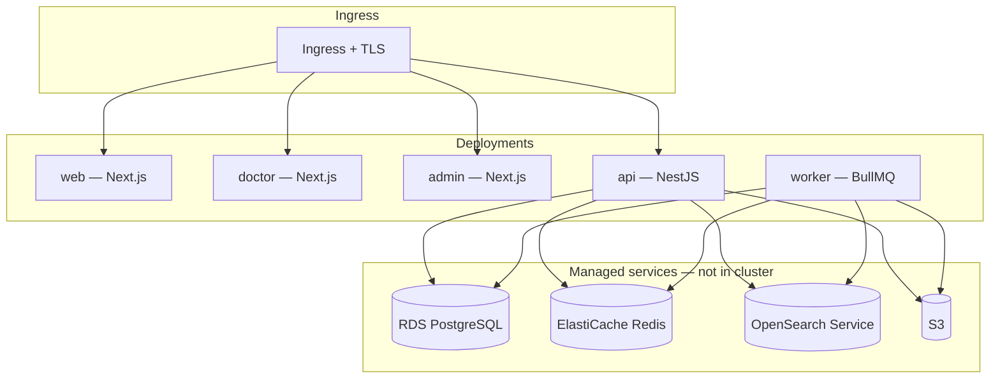

# Kubernetes — deployment outline

Future production deployment topology for HomeopathyPharma.com. No manifests are committed yet — this document guides Phase 6 hardening.

## Cluster assumptions

| Item | Recommendation |
|------|----------------|
| Cloud | AWS EKS, GKE, or managed k8s (TBD) |
| Ingress | nginx-ingress or cloud ALB + WAF |
| TLS | cert-manager + Let's Encrypt or ACM |
| Secrets | External Secrets Operator → Vault / AWS Secrets Manager |
| Container registry | ECR / GCR / GHCR |

## Workloads



| Deployment | Replicas (initial) | HPA metric |
|------------|-------------------|------------|
| `web` | 2 | CPU 70% |
| `doctor` | 2 | CPU 70% |
| `admin` | 2 | CPU 70% |
| `api` | 3 | CPU 60%, request latency |
| `worker` | 2 | queue depth (custom metric) |

Worker HPA should scale `search-index` and `sitemaps` consumers independently if queue lag exceeds SLO.

## Namespaces

| Namespace | Contents |
|-----------|----------|
| `hp-production` | App workloads |
| `hp-staging` | Staging mirrors |
| `hp-observability` | Prometheus, Grafana agents (optional) |

## ConfigMaps & secrets

| Key | Source |
|-----|--------|
| Non-secret env | ConfigMap per app (`WEB_URL`, feature flags) |
| `DATABASE_URL` | Secret |
| `REDIS_URL` | Secret |
| `SESSION_SECRET` | Secret |
| Razorpay / Shiprocket / Google | Secret |
| S3 credentials | Secret or IRSA/workload identity |

## Health probes

**API (`/v1/health`):**

- `livenessProbe` — process up
- `readinessProbe` — Postgres + Redis reachable

**Worker:**

- `livenessProbe` — event loop responsive
- No HTTP readiness — use BullMQ connection check

**Next.js apps:**

- `readinessProbe` — `GET /health` (implement in each app)

## Migrations

Run as **Job** before API rollout:

```yaml
# Pseudocode
kind: Job
metadata:
  name: db-migrate
spec:
  template:
    spec:
      containers:
        - name: migrate
          command: ["pnpm", "db:migrate:deploy"]
      restartPolicy: Never
```

Never run `migrate:dev` in production.

## Networking

- Private subnets for API/worker → RDS/Redis/OpenSearch
- Public ingress only for web/doctor/admin/api
- NetworkPolicy: worker cannot receive ingress from internet

## Observability

- OpenTelemetry collector DaemonSet
- Structured logs → CloudWatch / Loki
- Sentry DSN per deployment

## Rollout strategy

- Rolling update for stateless apps
- API: maxUnavailable 0, maxSurge 1 during business hours
- Database migrations backward-compatible (expand-contract pattern)

## Related

- [../terraform/README.md](../terraform/README.md)
- [../nginx/README.md](../nginx/README.md)
- [../../docs/ARCHITECTURE.md](../../docs/ARCHITECTURE.md)
